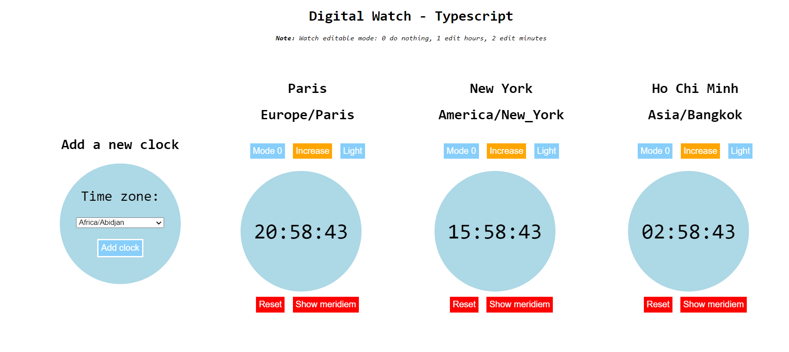

# Digital Watch - typescript
Digital Watch typescript project
Using TypeScript create many digital watch by timezones and Stopwatch.

## Demo

[Live Demo](https://digital-watch-ts-yenguyen.netlify.app/)



## Run

- Clone the Repo
  ```bash
  git clone https://github.com/yennguyenthihoang/digital-watch-typescript-app.git
  cd digital-watch-typescript-app
  ```
- Install Node Modules
  ```bash
  npm install
  ```
- Build
  ```bash
  npm run build
  ```
- Run
  ```bash
  npm run start
  ```
  The App will be live at `http://localhost:1234/`

